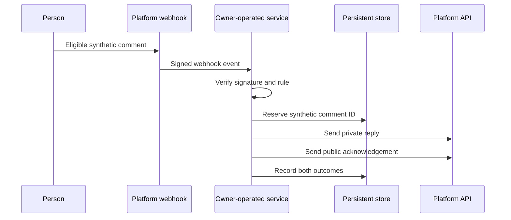

# From paid automation to owner-governed infrastructure

**Language:** English · [Português (Brasil)](README.pt-BR.md)  
**Classification:** real applied case, sanitized for public release.

## Outcome in one sentence

An owner-operated service reproduced one Instagram comment-to-private-reply workflow while making authorization, external effects, persistence, and operational responsibility inspectable.

The private operational record reports one successful external end-to-end test. This public package does not contain production logs and does not claim an SLA, long-term reliability, or general safety.

## Context

A paid automation subscription was expiring. The essential behavior was narrow: when a person used an eligible keyword on a participating post, the system should send the corresponding material privately, add a public acknowledgement, and avoid duplicate sends.

The project tested whether that capability could move to an owner-governed service using official platform APIs and free-tier infrastructure without hiding the new maintenance burden.

## Constraints

- No new recurring platform fee within the providers' free-tier limits at the time.
- No credentials, production identifiers, or campaign configuration in the public repository.
- Explicit owner authorization before deployment and publication effects.
- Signed webhook validation and persistent duplicate reservation.
- Separate records for the public and private external effects.
- Honest reporting of failure windows and provider limitations.

## Sanitized architecture

The production implementation is a Node.js service with HMAC-SHA256 webhook verification, deterministic keyword rules, PostgreSQL persistence, separate private/public delivery status, and dependency health checks.

## Why the trajectory mattered

A demonstration could show two messages arriving and still hide important properties:

1. **Authorization was staged.** Creating a draft implementation, storing credentials, deploying, and enabling public effects were distinct decisions.
2. **Local success was not durability.** An early local database approach would not survive the hosting lifecycle, so persistence moved to an external database.
3. **Deduplication has a trade-off.** Reserving a comment before sending reduces duplicates but, without leases and retry states, a failed attempt may never be retried.
4. **Acknowledgement is not completion.** The platform receives a quick acknowledgement before the work becomes durable, leaving an event-loss window if the process stops.
5. **Database minimization is not log minimization.** The database avoids comment text, but current application logs include a username, technical identifier, automation name, and link.
6. **Free pricing transfers responsibility.** Subscription cost was reduced, while token maintenance, provider changes, monitoring, and incident response moved to the owner.

## Evidence available

| Evidence | What it supports | What it does not support |
|---|---|---|
| Private source snapshot with 33 tracked files | An implementation and bilingual operating documentation exist | Independent code review or public reproducibility of production |
| Fourteen passing automated tests on 2026-08-27 | Known local rules and components behaved as expected | Live provider compatibility or long-term reliability |
| Locked dependency audit with zero findings on 2026-08-27 | No known package vulnerability was reported at that time | Future dependency safety or absence of application flaws |
| Private operational record dated 2026-08-18 | One real external test was recorded as producing both replies | SLA, delivery rate, or independent verification |
| [Synthetic trajectory](../../reproducibility/data/applied/instagram-comment-dm.synthetic.json) | The public schema can represent the intended control and effect sequence | A production trace or proof that the real event followed every step |

## Controls implemented in the private snapshot

- HMAC-SHA256 verification for incoming webhook payloads.
- Provider-managed environment secrets rather than committed credentials.
- Persistent reservation by comment identifier before external sends.
- Separate status and error fields for private and public effects.
- Database and platform-token health checks.
- Legal routes for privacy, terms, and deletion instructions.

These are implementation controls, not proof of production-grade isolation.

## Open risks

- No durable job queue between webhook acknowledgement and processing.
- No lease-based retry state machine for partial or transient failure.
- More personal and operational data in logs than the public minimal-storage summary originally implied.
- Health output reveals limited dependency status.
- Test doubles do not detect provider API or permission drift.
- Free-tier hosting provides no production SLA.

## Next valid step

Implement durable enqueueing, explicit retry/terminal states, privacy-safe logging, and a documented observation window. Only then should the case make a stronger reliability statement.

See the [evidence ledger](EVIDENCE-LEDGER.md) and [publication review](PUBLICATION-REVIEW.md).
