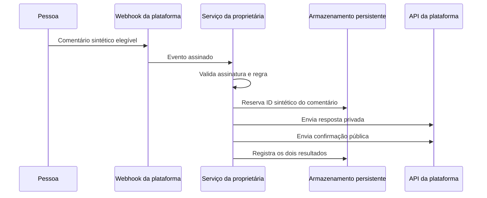

# Da automação paga à infraestrutura governada pela proprietária

**Idioma:** [English](README.md) · Português (Brasil)  
**Classificação:** caso aplicado real, sanitizado para publicação.

## Resultado em uma frase

Um serviço operado pela proprietária reproduziu um fluxo de comentário para resposta privada no Instagram e tornou inspecionáveis autorização, efeitos externos, persistência e responsabilidade operacional.

O registro operacional privado relata um teste externo completo bem-sucedido. Este pacote público não contém logs de produção e não afirma SLA, confiabilidade de longo prazo ou segurança geral.

## Contexto

Uma assinatura paga de automação estava expirando. O comportamento essencial era limitado: quando uma pessoa usasse uma palavra elegível em uma publicação participante, o sistema deveria enviar o material correspondente em privado, adicionar uma confirmação pública e evitar envios duplicados.

O projeto testou se essa capacidade poderia migrar para um serviço governado pela proprietária, usando APIs oficiais e infraestrutura gratuita, sem esconder a nova carga de manutenção.

## Restrições

- Nenhuma nova mensalidade dentro dos limites gratuitos dos provedores naquele momento.
- Nenhuma credencial, identificador de produção ou configuração de campanha no repositório público.
- Autorização explícita da proprietária antes de deploy e efeitos públicos.
- Validação de webhook assinado e reserva persistente contra duplicidade.
- Registros separados para os efeitos público e privado.
- Relato honesto das janelas de falha e limitações dos provedores.

## Arquitetura sanitizada

A implementação de produção é um serviço Node.js com verificação HMAC-SHA256, regras determinísticas, persistência PostgreSQL, estados separados das entregas privada/pública e health checks das dependências.

## Por que a trajetória importou

Uma demonstração poderia mostrar duas mensagens chegando e ainda esconder propriedades importantes:

1. **A autorização ocorreu em etapas.** Criar a implementação, armazenar credenciais, fazer deploy e habilitar efeitos públicos foram decisões distintas.
2. **Sucesso local não era durabilidade.** Uma primeira solução de banco local não sobreviveria ao ciclo de vida da hospedagem, então a persistência migrou para um banco externo.
3. **Deduplicação possui trade-off.** Reservar o comentário antes do envio reduz duplicidades, mas, sem leases e estados de retry, uma tentativa com falha pode nunca ser repetida.
4. **Confirmação não é conclusão.** A plataforma recebe rapidamente uma confirmação antes de o trabalho se tornar durável, deixando uma janela de perda caso o processo pare.
5. **Minimização no banco não é minimização nos logs.** O banco evita o texto do comentário, mas os logs atuais incluem username, identificador técnico, automação e link.
6. **Preço gratuito transfere responsabilidade.** O custo de assinatura diminuiu, enquanto manutenção do token, mudanças dos provedores, monitoramento e incidentes passaram para a proprietária.

## Evidências disponíveis

| Evidência | O que sustenta | O que não sustenta |
|---|---|---|
| Snapshot privado com 33 arquivos rastreados | Existe uma implementação e documentação operacional bilíngue | Revisão independente do código ou reprodução pública da produção |
| Quatorze testes automatizados aprovados em 2026-08-27 | Regras e componentes locais conhecidos funcionaram como esperado | Compatibilidade atual com o provedor ou confiabilidade de longo prazo |
| Auditoria das dependências travadas sem achados em 2026-08-27 | Nenhuma vulnerabilidade conhecida foi reportada naquele momento | Segurança futura das dependências ou ausência de falhas na aplicação |
| Registro operacional privado de 2026-08-18 | Um teste externo real foi registrado com as duas respostas | SLA, taxa de entrega ou verificação independente |
| [Trajetória sintética](../../reproducibility/data/applied/instagram-comment-dm.synthetic.json) | O schema público representa a sequência planejada de controles e efeitos | Uma trajetória de produção ou prova de que o evento real seguiu cada etapa |

## Controles implementados no snapshot privado

- Verificação HMAC-SHA256 dos webhooks recebidos.
- Segredos gerenciados pelo provedor, sem credenciais versionadas.
- Reserva persistente por identificador antes dos envios externos.
- Campos separados de estado e erro para efeitos privado e público.
- Health checks do banco e do token da plataforma.
- Rotas legais de privacidade, termos e instruções de exclusão.

Esses são controles de implementação, não prova de isolamento em nível de produção.

## Riscos em aberto

- Ausência de fila durável entre confirmação do webhook e processamento.
- Ausência de máquina de retry com lease para falhas parciais ou transitórias.
- Mais dados pessoais e operacionais nos logs que o resumo original de armazenamento mínimo sugeria.
- O health check revela um estado limitado das dependências.
- Dublês de teste não detectam mudanças na API ou nas permissões do provedor.
- Hospedagem gratuita não oferece SLA de produção.

## Próximo passo válido

Implementar fila durável, estados explícitos de retry/terminal, logs compatíveis com minimização e uma janela documentada de observação. Somente depois disso o caso deve fazer uma afirmação mais forte de confiabilidade.

Consulte o [ledger de evidências](EVIDENCE-LEDGER.md) e a [revisão de publicação](PUBLICATION-REVIEW.md).
